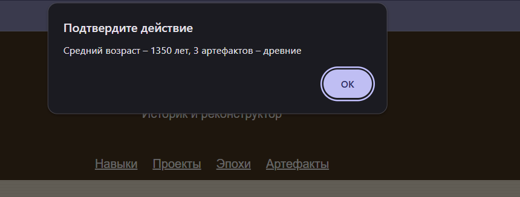
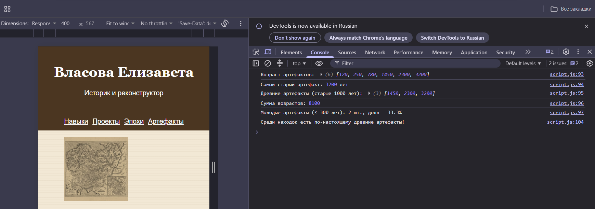

# Лабораторная работа №4. Основы JavaScript

Страница «О себе», вариант 19 — «Историк и реконструктор».
В этой работе к странице из ЛР №3 добавлен скрипт `script.js`.

## Что сделано
- `prompt` спрашивает имя, `alert` выводит приветствие
- есть условия (`if`) и циклы (`for`)
- функции для максимума, фильтрации и суммы
- вся логика в функциях, вывод в функции `main()`

## Задача по варианту
Массив с возрастом артефактов в годах: `[120, 250, 780, 1450, 2300, 3200]`

- самый старый артефакт — 3200 лет
- древние (старше 1000 лет) — 3 штуки
- средний возраст — 1350 лет
- молодые (до 300 лет) — 2 штуки, это 33.3%
- максимум больше 3000, поэтому в консоли есть фраза «Среди находок есть по-настоящему древние артефакты!»

## Как это выглядит

Окно alert:

Консоль:

## Отладка
Ошибки смотрела в консоли браузера (F12), значения проверяла через `console.log()`.

## Файлы
- `index.html` — страница
- `style.css` — стили
- `script.js` — скрипт
- `images/` — картинки
- `screenshots/` — скриншоты
